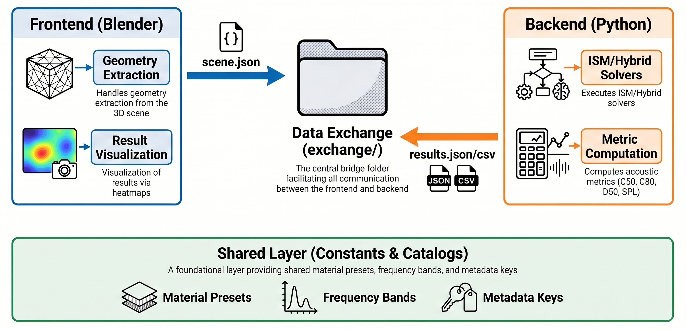

# BlenderAcoustics

BlenderAcoustics is a Blender-based room-acoustic simulation and visualisation tool built with a Python backend using Pyroomacoustics. The project connects geometric scene preparation, room impulse response simulation, acoustic-parameter extraction and viewport heatmap visualisation in a single workflow.

The tool was developed as part of the MAE Capstone Course at Politecnico di Milano.

## Overview

BlenderAcoustics allows a user to define a room scene in Blender, place acoustic sources and receiver areas, export the scene to a structured JSON format, run a Pyroomacoustics-based simulation backend and visualise room-acoustic metrics directly inside the Blender viewport.

The current implementation is designed for early-stage acoustic analysis and workflow prototyping. It is not intended as a replacement for full commercial acoustic-simulation packages or full-wave solvers.

## Main Features

- Blender frontend for room geometry, source placement and receiver-grid definition.
- Python backend based on Pyroomacoustics.
- Image Source Method (`ISM_ONLY`) and hybrid Image Source Method + Ray Tracing (`HYBRID_RT`) execution modes.
- File-based data exchange through JSON and CSV files.
- Room impulse response based metrics: `C50`, `C80`, `D50` and relative SPL.
- Receiver markers and heatmap mesh overlays inside Blender.
- Zone-based furniture absorption model for objects such as sofas, bookshelves and windows.
- Structured backend/frontend/shared code organisation.
- Automated tests for selected geometry, validation and import routines.

## Repository Structure

```text
blender-acoustics/
├── backend/                  # Pyroomacoustics backend, room setup, solvers and post-processing
├── frontend/                 # Blender scene extraction, UI panels, operators and visualisation logic
├── shared/                   # Shared constants and schema keys used by frontend and backend
├── exchange/                 # Runtime exchange folder for scene.json, results.json and results.csv
├── examples/                 # Example Blender scene files
├── tests/                    # Python tests for non-Blender backend components
├── docs/                     # Project report and documentation sources
├── assets/figures/           # Figures used in the README and documentation
├── blender_acoustics.py      # Blender entry-point script
├── environment.yml           # Conda environment specification
├── requirements.txt          # Python dependency list
├── pytest.ini                # Pytest configuration
├── AUTHORS.md
├── LICENSE
└── README.md
```

## System Architecture

The software is organised around three layers:

1. **Blender frontend**: validates scene objects, extracts room geometry, generates receiver grids, exposes simulation controls and visualises results.
2. **Exchange layer**: stores the simulation input and output in `exchange/scene.json`, `exchange/results.json` and `exchange/results.csv`.
3. **Python backend**: validates the exported scene, builds the Pyroomacoustics room, dispatches the selected solver and computes acoustic metrics from simulated RIRs.



## Installation

A dedicated Python environment is recommended because the backend depends on Pyroomacoustics.

```bash
conda env create -f environment.yml
conda activate pra_test
```

Alternatively, install the dependencies manually:

```bash
pip install -r requirements.txt
```

The project has been developed with Python 3.10 and Pyroomacoustics 0.10.0.

## Basic Usage in Blender

1. Open Blender.
2. Open an example scene from `examples/`, or prepare a new room scene.
3. Go to the **Scripting** workspace.
4. Open `blender_acoustics.py` from this repository.
5. Run the script with `Alt+P` or the **Run Script** button.
6. Open the 3D Viewport sidebar with `N`.
7. Use the **Room Acoustics** tab to set:
   - project directory;
   - Python executable pointing to the Conda environment;
   - octave band;
   - material presets;
   - solver mode;
   - receiver grid parameters.
8. Run the acoustic simulation.
9. Visualise receiver markers or heatmap overlays in Blender.

Scene objects must follow these naming conventions:

- `RoomVolume` for the main room mesh;
- `SRC_*` for acoustic sources;
- `MAP_*` for receiver mapping areas.

## Validation

The project report compares BlenderAcoustics with Pachyderm Acoustics for a representative test room at 500 Hz using ISM order 10. The comparison reports small differences for clarity-related metrics and a larger SPL discrepancy, consistent with the current bounding-box approximation used in the simulation workflow.

The full technical report is available in:

```text
docs/blender_acoustics_report.pdf
```

## Current Limitations

- The acoustic simulation uses a bounding-box approximation for the Image Source Method backend.
- Strongly non-convex, coupled-volume or geometrically complex rooms may not be represented accurately by the current solver approximation.
- Material assignment is based on global surface categories rather than full per-face material mapping.
- The metric set is currently limited to `C50`, `C80`, `D50` and relative SPL.
- Source averaging is performed on metric values and does not represent a physically combined multi-source RIR.
- The Blender frontend depends on exact scene naming conventions.
- Validation is limited to a representative reference configuration and should be extended before using the tool for design-critical predictions.

## Relevance

This project is relevant to acoustic simulation workflows because it combines geometry preparation, simulation orchestration, structured data exchange, objective room-acoustic metrics and spatial result visualisation. It also illustrates how an engineering simulation workflow can be connected to an interactive visual environment while keeping the numerical backend inspectable and reproducible.

## Authors

See [AUTHORS.md](AUTHORS.md).

## Licence

This project is released under the MIT Licence. See [LICENSE](LICENSE).
